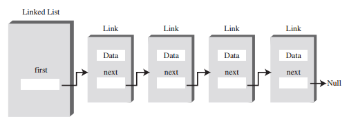
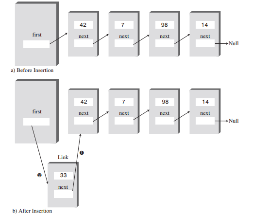
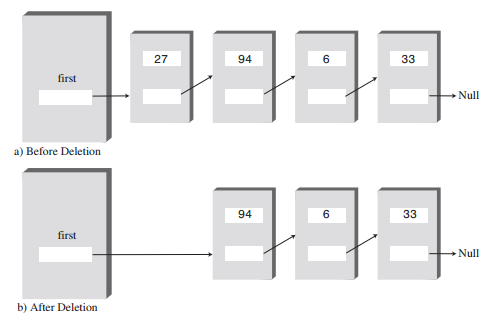
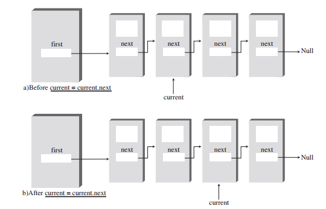
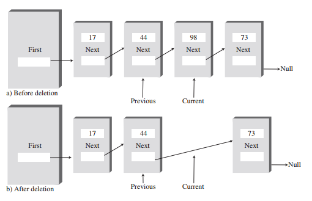

# Linked Lists
The linked list is a versatile mechanism suitable for use in
many kinds of general-purpose databases. It can also
replace an array as the basis for other storage structures
such as stacks and queues. In fact, you can use a linked list
in many cases in which you use an array, unless you need
frequent random access to individual items using an index.

### Links in a list.

### Uml.

### Methods:
* `insertFirst`
* `deleteFirst`
* `find`
* `delete`
* `insertAfter`
* `displayList`
* `others`

### The `insertFirst()` Method

### The `deleteFirst()` Method

### The `displayList()` Method

### The `delete()` Method

### Linked-List Efficiency
 Insertion and deletion at the beginning of a linked list are very fast. They involve
changing only one or two references, which takes O(1) time.
Finding, deleting, or inserting next to a specific item requires searching through, on
the average, half the items in the list. This requires O(N) comparisons. An array is
also O(N) for these operations, but the linked list is nevertheless faster because
nothing needs to be moved when an item is inserted or deleted. The increased efficiency can be significant, especially if a copy takes much longer than a comparison.
Of course, another important advantage of linked lists over arrays is that a linked list
uses exactly as much memory as it needs and can expand to fill all of available
memory. The size of an array is fixed when it’s created; this usually leads to inefficiency because the array is too large, or to running out of room because the array is
too small. Vectors, which are expandable arrays, may solve this problem to some
extent, but they usually expand in fixed-sized increments (such as doubling the size
of the array whenever it’s about to overflow). This solution is still not as efficient a
use of memory as a linked list.
